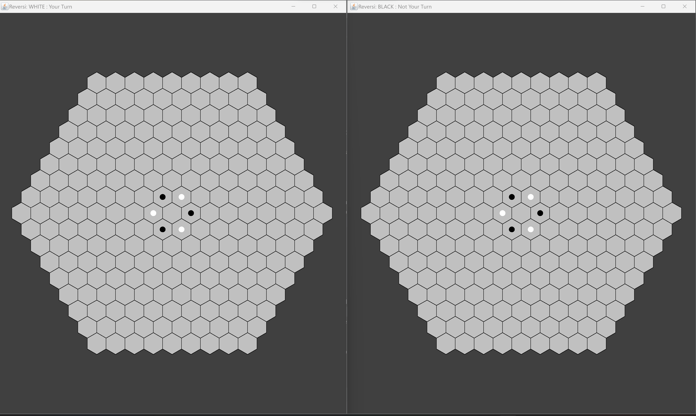
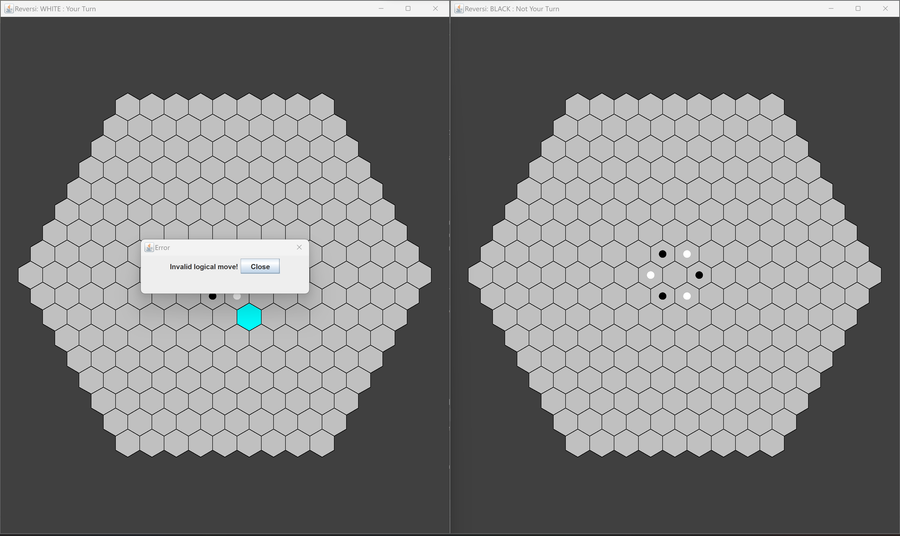
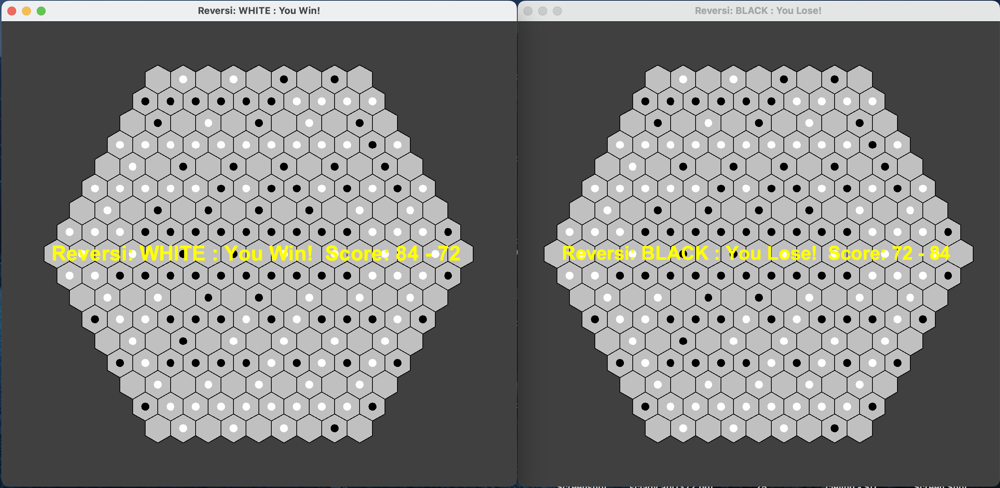

# Hexagonal Reversi Game
**By Daniel Yu and Anika Sharma**

<!-- TOC -->
* [Hexagonal Reversi Game](#hexagonal-reversi-game)
  * [Overview](#overview)
  * [Quickstart](#quickstart-)
  * [Model](#model)
    * [Colors](#colors-)
    * [Coordinate System](#coordinate-system)
    * [Board](#board)
      * [Board Generation](#board-generation)
      * [Game State](#game-state)
    * [Reversi Models](#reversi-models)
  * [Player](#player)
    * [Strategies](#strategies)
  * [View](#view-)
    * [Textual View](#textual-view)
    * [GUI View](#gui-view)
  * [controller](#controller)
  * [Changes for Part II](#changes-for-part-ii)
  * [Changes for Part III (from Part II)](#changes-for-part-iii-from-part-ii)
  * [Changes for Part IV to allow functionality with providers code](#changes-for-part-iv-to-allow-functionality-with-providers-code)
<!-- TOC -->

## Overview
This is an overview of our implementation for the Reversi Model game. Please skip to the 
Coordinate System and Board State subsections to get an idea of any 
assumptions made!

## Quickstart 
1. Run [Reversi](src/Reversi.java) main method
   1. The default setting for no input is two human players, i.e. an input of "human human".
   2. Customizing game:
      - String commands, with spaces in between, to pick the player and, if computer player, 
      strategy.
      - There must be two players picked.
      - First word is the first player, either "human" or "computer".
      - If picked "computer" as player 1, then second word must be the strategy.
        - Supported strategies for player 1: "CaptureMostPieces"
      - The next word will be the second player, and if the computer player is picked,
      there must be a next word for the strategy.
        - Supported strategies for player 2: "CaptureMostPieces", "Strategy1": GetHighestScore, 
        "Strategy2": AvoidNextToCorner, "Strategy3": GetCorner, "Strategy4": MinMax
   2. Note that the screens may start overlapped on one another, just move them apart.
   

2. Start clicking a cell for the Player whose turn it is, then press enter or "p" for pass and 
    watch the view update.
   1. Any improper moves should have a pop like so:


3. Finish the game by playing to completion!


4. Mess around with our AI players, different board sizes, multiple games, etc.

**Basic Design:**
```text
Human player -> Screen(GUI) -> controller -> model
<-  Screen(GUI) <- controller <-
(loop)

AI -> controller -> model
<- BoardState
(loop)
```

**View**
1. Run [Reversi](src/Reversi.java) main method

2. Try selecting cells

3. Try configuring it with intermediate game states from the 
   [Reversi Game State Generator](test/model/ReversiModelGameStateGeneration.java) and updating that
   in the [Reversi Tester](test/model/ReversiTester.java). Here's an example (on a smaller window
   to demonstrate resizability):

4. Mess around with other custom board states!

---
**Illustrative Tests**
1. Run the publicly available tests to get an idea of the code
2. Run the tests inside of the model package for the model package tests to get an
   idea of the functionality
   3. Specifically take a look at ModelViewIntegrationTests
3. Run the tests inside view to get an idea of the board state

Excerpt from ModelViewIntegrationTests:
```java
    Assert.assertEquals(this.view.render(),
            "   _ _ _   \n" +
            "  _ X O _ \n" +
            " _ O _ X _ \n" +
            "  _ X O _ \n" +
            "   _ _ _   ");
    this.model.move(1, -2, 1);
    Assert.assertEquals(this.view.render(),
            "   _ O _   \n" +
            "  _ O O _ \n" +
            " _ O _ X _ \n" +
            "  _ X O _ \n" +
            "   _ _ _   ");
```

## Model

### Colors 
We created a public enum representing the Players white and black, following the 
specifications of the assignment. But since it is an enum, we can easily allow 
for additional players by adding new enumerations. We gave the enum a next 
method which would just return the next player in the sequence by ordinal to 
allow for players to switch turns.

### Coordinate System
The coordinates are represented in the Hexagon class by each instance.

The first design decision we had to make for this assignment was the coordinate
system for the Hexagonal Grid. We decided to use the Cube Coordinate System for
several reasons:
1. We wanted to track the q,r,s coordinates so when implementing our model we had
   the ability to directly generate the line across the q coordinate, r coordinate,
   and s coordinates which would make validating and performing moves easier.
2. Although the axial coordinate system simplifies the cube coordinate system into
   two coordinates while preserving the q+r+s = 1 equality. We felt that having
   the two coordinates while making our code seem simpler actually reduces readability
   since now the developer must remember and recompute that s coordinate.
This design decision now meant that the Hexagon object should have three fields,
one for each coordinate.

When generating the coordinate system of all the hexagons in the grid, we knew that:
1. the generated product must be a large **REGULAR** hexagon composed of unit hexagons
2. the distance must be equilateral to the origin from any hexagon on the edge, essentially
   forming concentric "rings" of hexagons for each unit hexagon distance away from the origin.
Thus, this made determining the origin really easy, as we could simply set the Hexagon
as the hexagon at the center of the coordinate system and generate Hexagons ring by ring
until we reached the specified distance away from the center.

We decided to arbitrarily set the direction that the hexagons would be generated in
as clockwise (either cw or ccw would have been equivalent).

### Board

#### Board Generation
The second design decision, building on our coordinate system, was to design the Board
class that would contain the previous logic of generating the board with the coordinate
system as well as serving to keep track of the state of the Board in a game of Reversi.

Thus, the Board will have all the logic of what a valid Hexagonal Board for the game 
**SHOULD BE** at the start of the game and updating the state of the Game when any move is played.

> Based on this idea, we made the Board only take in an integer specifying the size (i.e.
number of concentric hexagon rings the board should have). We made the decision to 
disallow the board to have less than a size of 2, meaning a board of only 1 hexagon and
the board of only 7 hexagons (starting state of 3 white, 3 black) would be disallowed
since in the first option, nothing could be moved and in the second option, the 
game would be trivial. So the game has to at least have 19 hexagons and 3 rings. Notes
that size is indexed at 0, so two rings would be size of 1 and three rings would be size 
of 2.

Then we implemented the generation following the specifications above of generating
in clockwise direction starting from the origin and rotating outward where the hexagon
to the left is generated first then the rest in clockwise order until the ring is 
completed in which case we repeat until size is reached. 

This was done using the idea of Neighbors in [redblobgames](https://www.redblobgames.com/grids/hexagons/)
and the cube_direction_vectors representing the 6 surrounding hexagons of a given hexagon
where we used cube_direction_vectors to recursively generate those neighboring hexagons 
until done.

#### Game State
For purposes of tracking the game state, i.e. which Hexagons are occupied and which 
Players are occupying said hexagons, we decided to implement a Hashmap containing 
**ONLY** the occupied hexagons as keys and the occupying player as values. Then in the model
we made sure to update the Board appropriately.

### Reversi Models
There are two levels to the model, which is implemented as 2 interfaces: a read-only model to make 
observations about the board and the state of the game, and the mutable model which contains any
methods that modify the board state directly or indirectly.

The read-only model is used by the view and other parts that should not be able to make moves.

The overall model needs to get the Game State, implement the logic of rules-keeping, then perform a 
move when valid and update the Game State.

Class Invariant: At all moments the board must be in a valid state i.e. there can't be a tile
occupied by a color that has no surrounding neighbors. This is except when testing the
package private constructor WHICH IS package private for that reason. So for the client, this
invariant always holds.

We gave the model a field containing the Board (representing the game state at 
any given time for the model) and the current player whose turn it is. We made
the decision to start the game with the first player as WHITE, since in board
games white always goes first. 

Through our logic, each model would generate a new Board which would track that
models game state, thus allowing the model to only have to handling getting the
game state from the Board then using that information to validate and perform 
moves, then updating the Board. This is all enforced in the specific methods we
implemented.

Specifically:
1. Gave the model a pass boolean to check if two players have passed in a row.
2. Gave the model a isGameOverField that prohibits moves from being made.
3. Decided that if a player can't move then they have to be forced to pass and
   have that enforced in the model by checking after a move if that next player
   can move.

## Player
High-level Player Interface which has human and AI Players. Each player takes in an Infallible 
strategy. Each Player is functional object implementing one method, the make move (outside of the
getColor() method which is a getter). The human implements a stub makeMove method since all human 
moves should be user inputs from the GUIView not from the PlayerAction. The AI player does implement
the makeMove() method which depending on the strategy, makes the best available move or passes if 
there aren't any, mutating the model state. Each time the model is updated, it notifies the 
subscribers including AI Players who will then call makeMove if it is their turn to move.

### Strategies
Players can utilize our strategies to choose a smarter move. The strategy will return an array of 
length 3, representing the q, r, and s coordinates of the move the player should make.

Currently, there is only one strategy implemented: picking the valid move that will flip the most 
discs in favor of the current player. This strategy is fallible, meaning it may return a move or
might not if the strategy could not find one.

Other strategies to implement might be playing to at the cells edges and avoiding cells right 
before the edge.

We have the framework to chain together multiple fallible strategies into use it as one infallible
strategy. To chain infallible strategies, use the ComposeFallibleStrategies class and pick a first
strategy and a second which can be an individual strategy or another composite. To convert a 
fallible strategy to infallible, use the CompleteStrategyFromFallible class.


## View 

### Textual View
For our view we decided to make the textual view with a single method which 
would be the render method. We kept the ideas consistent with the Klondike Game
and had a string builder that built the view based on the state of the board with
O representing white, and X representing black, and _ representing no piece. To 
make our design more extensible for later changes that we know will come (like the GUI)
we created an intermediate abstract class called HexagonalRepresentation that 
solely returns the board state as int[][] so that this datatype could be left 
to be used by any type of view not just textual.

For HexagonalRepresentation, a 0 represents unoccupied, 1 representings Player 1 
occupied, and 2 represents Player 2 occupied where Player 1 is always white and 
Player 2 is always black.

### GUI View
For our view, there were really three components to handle:
1. The GUIView interface representing the overall GUI
2. The ReversiPanel interface representing the hexagonal board within the GUI
3. The Path2DHexagon represents the drawn Hexagon in the GUI with its associated
   state

> ReversiGraphicsView implemented the GUIView, creating the JFrame that the 
> JPanel implemented by the Reversi Hexagonal Panel would be contained within. We decided to
> implement the KeyListener methods here and in the future when the controller is
> implemented, we will have the GUIView then tell the ReversiPanel to update appropriately.
> 
> For the ReversiHexagonalPanel, we chose to first transform the Java Swing coordinate
> system of the origin being top left and the +y direction being downwards to a standard
> cartesian coordinate system with the origin being the center of the screen and up being
> +y, down being -y, right being +x, and left being -x. This mean the center hexagon would
> be placed at the center with all the other hexagons relative to it on a x,y basis, allowing 
> for easier q,r,s to x,y coordinate conversions. We added the MouseListeners in this class
> to account for the clicking onto the hexagonal grid, and convert the mouse clicks from 
> Swing coordinates to our standard cartesian coordinates. Another decision we made was to have the 
> drawnHexagons be re-used in the paint component since the Path2DHexagon could be thought
> of as containing the logic inherent to drawnHexagon and the number of drawnHexagons would not 
> change, maybe only their color (if clicked), or size (when the panel resizes). This saves 
> memory, and allows us to "track" the state of the Panel.
> 
> For Path2DHexagon, this class contained the logic inherent to a drawn Hexagon in the GUI. 
> Thus, we decided to have it track the q,r,s coordinates of the hexagon which should always
> be the same as the logical coordinates of the hexagon in our model, thus storing the 
> conversion. 

## controller
The controller represents our intermediary between the model and view. 

Interestingly, our original design of MVC has proved resilient and ended up being the final 
implementation we went with. Here is the design re-iterated:
```text 
|----> Human player -> Screen(GUI) -> controller -> model \/
/\  Screen(GUI) <- controller <- ------------------------ |
(loop)

|----> AI -> controller -> model \/
/\ Screen(GUI) <- controller  <-- |
(loop)
```
Since our Reversi Game is designed to be ascynchronous with players being able to interact 
with the board at any stage of the game and events can come at any time but the game play is turn 
based, we needed a controller capable of reconciling the asynchronous nature of events to the 
synchronous nature of the model state (and thus GUI view) which should respond no matter which 
player moves.

Essentially, there are two directions of mutations to the model: the view (from a human player when
they click on a cell and press enter or "p" for pass to make a move) and the AI Player which, when 
its their turn, directly plays a move on the model. Note the AI Player doesn't need any information
about the view. This is what the diagram above is depicting.

Based on those two necessities, we implemented two features interfaces, one representing the 
[Model-State](src/controller/ModelObserverFeatures.java), the other representing the 
[Player to View](src/controller/PlayerActionFeatures.java). At the high level, the first interface
was an Observer Pattern that after the model state changed, asked any AI Players to make a move, 
then told the views to update for every player and view subscribed to the model. The second 
interface is meant to be called by the View when a player presses enter to play a move or "p" to 
pass a move, then the interface tells the model state to update.

For a human player, once they make a move on the view, the view will notify the 
playerActionFeatures, who will request the move on the model. If the move is invalid, the model 
will throw an exception which is caught by the playerActionFeatures. The playerActionFeatures will
call the view to display a popup. If the move is valid, the model has a method called 
notifyMoveMade, which is called whenever any change is made to the model, such as move(), pass(), 
and startgame(). This method notifies the modelObserverFeatures that a move has been made.

The modelObserverFeatures will call the view to update itself and call the current player to make a 
move. If the current player is an AI player, the AI player will return the move based on the 
strategy and the modelObserverFeatures will pass the move to the model. If the current player is 
human, nothing happens and the flow will end until another flow is started by picking a move on the
view.

The game is started by the model notifying the modelObserverFeatures that game has started.

We made the decision to make the controller has-a instead of is-a feature interface to further 
decouple our controller which really only just setups up the interfaces and their responsibilities. 
delegating all the actual work of intermediating between MVC to the Impl classes: 
[ModelObserverFeaturesImpl](src/controller/ModelObserverFeaturesImpl.java) and
[PlayerActionFeaturesImpl](src/controller/PlayerActionFeaturesImpl.java).

**KeyNotes about Control Flow:**
1. See the [main](src/Reversi.java) method. It's what connects all the parts together. The set-up 
   happens in the main method, when the controller takes in the model view and player in its 
   constructor.Inthe controller's constructor, it sets both playerActionFeatures and 
   modelObserverFeatures as listeners to changes on the view.
2. controller class's sole purpose is for its constructor to set up each Features interface with the
   correct view, Player, and model, then telling the model to subscribe the 
   ModelObserverFeaturesImpl class as a listener and telling the view to add the 
   PlayerActionFeaturesImpl class as a listener for any key events.
2. Added methods to the model (see [Changes for Part III](#changes-for-part-iii-from-part-ii)) 
   for subscribing and updating listeners when a move is made.
3. StartGame notifies all the subscribers the game has started by doing the same thing as the notify
   method this is for the case the first player (WHITE) is an AI Player.


## Changes for Part II
1. We implemented a *read-only model* interface which had all the getter methods and 
   had our *ReversiModel* Interface extend that read-only interface. We then added a 
   few observation methods:
   1. get the size of the board
   2. made valid move from a private method to a public method declared in interface
   3. get the color at a specific cell
2. Then we altered our view to use only the Read-only model for the previous Textual
   view and for the GUI view we created for this part of the assignment.
3. The move method requires a player passed in and checks for it to be the currentPlayer.

## Changes for Part III (from Part II)
1. Model Changes:
   1. Added addModelFeatures(ModelObserverFeatures modelFeatures) method which subscribes the 
      controller as a listener to the model. Since each controller takes in a Model, View, and 
      Player, we ensure the model states are consistent across all views for each player by having 
      each controller, in the constructor, take in the same model, so they all "listen" to that 
      model whenever that model moves or passes.
   2. Added notifyMoveMade() that tells each controller listener to update their view. Again since,
      the subscribers are ensured in the main method to be set up correctly, notifications are sent
      to the correct views to tell those views to update 
   3. Added startGame() method which just calls the notifyMoveMade() at the start of the game. This
      is for the case that an AI Player has the first move.
2. View Changes:
   1. Changed the coordinate system to be inline with logical hexagon coordinates where instead of 
      the standard cartesian plane, we kept the y-coordinate inverted. Now, our origin is still at 
      the center of the screen and the +y direction points down and the -y direction points up. The
      x-axis has not changed.
   2. Refactored JFrame so that instead of implementing EventListener, the GUIView now has a
      addPlayerActionFeatures(PlayerActionFeatures playerActionFeatures) method which creates an
      anonymous class that functions as the event listener and passes whatever move is made to the
      playMove() or passMove() methods in the PlayerActionFeature interface.
   3. Added GameOver where if the model's game over method returns true, then when the view updates, 
      the gameOver() method is called which creates a glass pane (JPanel) that covers the entire 
      JFrame and intercepts any user input, effectively freezing the game at the last scene and
      displaying a Win,Tie, or Lose message with the score.
   4. Added update() method which tells the view to re-render
      1. Refactored ReversiHexagonalPanel to paint the panel with the current game state of the 
         model instead of always using the intial model state passed into the constructor
   5. Added errorMessage() method which is called whenever there is an error with a move such as if 
      it's illegal or no move is selected or it's not their turn to move, causing a modal dialog to 
      pop up which disables interaction with the view until the user closes the dialog. 

## Changes for Part IV to allow functionality with providers code
1. Strategies:
    1. Created a strategy adapter class to use the provider's strategy, yet return a move in the 
   format of an array of q, r, s.
   2. Added to getStrategy() in Reversi class to make sure only Player 2 had access to the 
   additional strategies from the providers.
   3. The options supported for player two's AI strategy are: "CaptureMostPieces", 
   "Strategy1": GetHighestScore, "Strategy2": AvoidNextToCorner, "Strategy3": GetCorner, 
   "Strategy4": MinMax
      - None of the strategies have chaining. This was a deliberate chouce as chaining is not
      implemented in our provider's code.