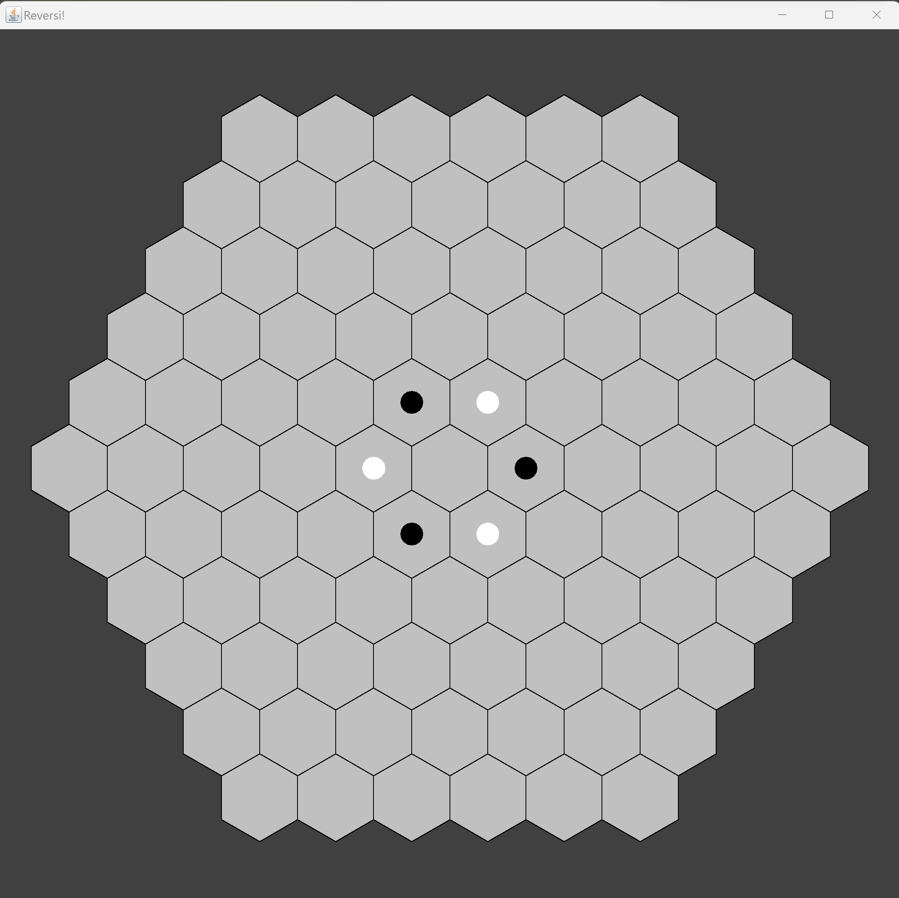
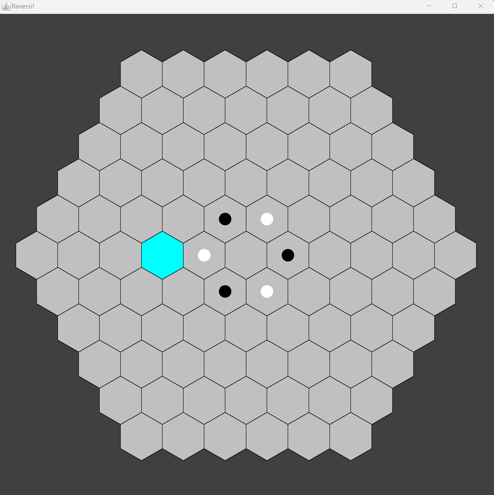
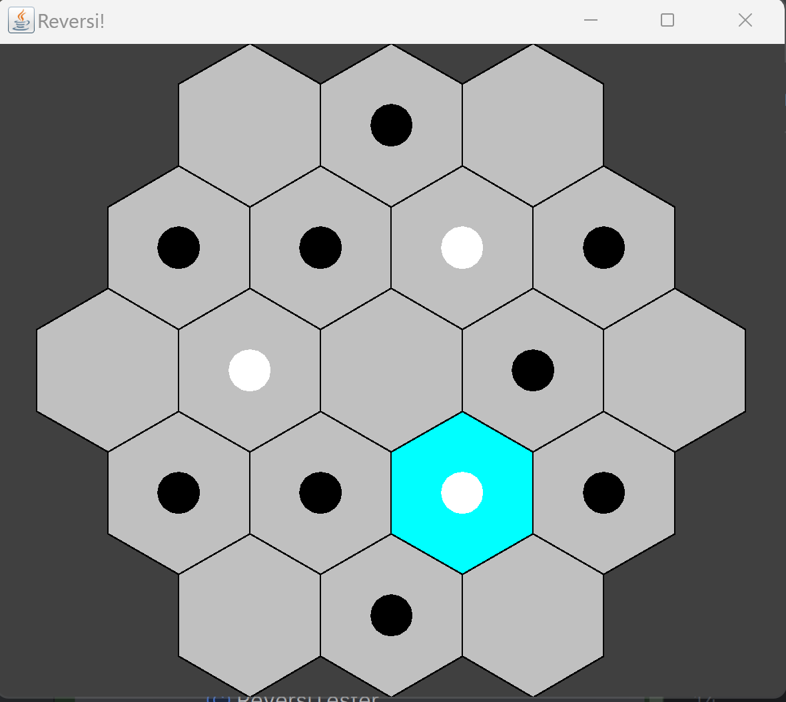

# Hexagonal Reversi Game
**By Daniel Yu and Anika Sharma**

<!-- TOC -->
* [Hexagonal Reversi Game](#hexagonal-reversi-game)
  * [Overview](#overview)
  * [Quickstart (Updated)](#quickstart-updated)
  * [Model](#model)
    * [Colors](#colors-)
    * [Coordinate System](#coordinate-system)
    * [Board](#board)
      * [Board Generation](#board-generation)
      * [Game State](#game-state)
    * [ReversiModel](#reversimodel)
  * [Player](#player)
  * [View](#view-)
    * [Textual View](#textual-view)
    * [GUI View](#gui-view)
  * [Controller](#controller)
  * [Changes for Part II](#changes-for-part-ii)
* [TODO](#todo)
<!-- TOC -->

## Overview
This is a over implementation for the Reversi Model game based on the 
standard rules of Reversi and on a Hexagonal board. Please skip to the 
Coordinate System and Board State subsections to get an idea of any 
assumptions made!

## Quickstart (Updated)
1. Run [Reversi](src/Reversi.java) main method 

2. Try selecting cells

3. Try configuring it with intermediate game states from the 
   [Reversi Game State Generator](test/model/ReversiModelGameStateGeneration.java) and updating that
   in the [Reversi Tester](test/model/ReversiTester.java). Here's an example (on a smaller window
   to demonstrate resizability):

4. Mess around with other custom board states!

---
**OLD**
1. Run the publicly available tests to get an idea of the code
2. Run the tests inside of the model package for the model package tests to get an
   idea of the functionality
   3. Specifically take a look at ModelViewIntegrationTests
3. Run the tests inside view to get an idea of the board state

Excerpt from ModelViewIntegrationTests:
```java
    Assert.assertEquals(this.view.render(),
            "   _ _ _   \n" +
            "  _ X O _ \n" +
            " _ O _ X _ \n" +
            "  _ X O _ \n" +
            "   _ _ _   ");
    this.model.move(1, -2, 1);
    Assert.assertEquals(this.view.render(),
            "   _ O _   \n" +
            "  _ O O _ \n" +
            " _ O _ X _ \n" +
            "  _ X O _ \n" +
            "   _ _ _   ");
```

## Model

### Colors 
We created a public enum representing the Players white and black, following the 
specifications of the assignment. But since it is an enum, we can easily allow 
for additional players by adding new enumerations. We gave the enum a next 
method which would just return the next player in the sequence by ordinal to 
allow for players to switch turns.

### Coordinate System
The first design decision we had to make for this assignment was the coordinate
system for the Hexagonal Grid. We decided to use the Cube Coordinate System for
several reasons:
1. We wanted to track the q,r,s coordinates so when implementing our model we had
   the ability to directly generate the line across the q coordinate, r coordinate,
   and s coordinates which would make validating and performing moves easier.
2. Although the axial coordinate system simplifies the cube coordinate system into
   two coordinates while preserving the q+r+s = 1 equality. We felt that having
   the two coordinates while making our code seem simpler actually reduces readability
   since now the developer must remember and recompute that s coordinate.
This design decision now meant that the Hexagon object should have three fields,
one for each coordinate.

When generating the coordinate system of all the hexagons in the grid, we knew that:
1. the generated product must be a large **REGULAR** hexagon composed of unit hexagons
2. the distance must be equilateral to the origin from any hexagon on the edge, essentially
   forming concentric "rings" of hexagons for each unit hexagon distance away from the origin.
Thus, this made determining the origin really easy, as we could simply set the Hexagon
as the hexagon at the center of the coordinate system and generate Hexagons ring by ring
until we reached the specified distance away from the center.

We decided to arbitrarily set the direction that the hexagons would be generated in
as clockwise (either cw or ccw would have been equivalent).

### Board

#### Board Generation
The second design decision, building on our coordinate system, was to design the Board
class that would contain the previous logic of generating the board with the coordinate
system as well as serving to keep track of the state of the Board in a game of Reversi.

Thus, the Board will have all the logic of what a valid Hexagonal Board for the game 
**SHOULD BE** and updating the state of the Game when any move is played.

> Based on this idea, we made the Board only take in an integer specifying the size (i.e.
number of concentric hexagon rings the board should have). We made the decision to 
disallow the board to have less than a size of 2, meaning a board of only 1 hexagon and
the board of only 7 hexagons (starting state of 3 white, 3 black) would be disallowed
since in the first option, nothing could be moved and in the second option, the 
game would be trivial. So the game has to at least have 19 hexagons and 3 rings. Notes
that size is indexed at 0, so two rings would be size of 1 and three rings would be size 
of 2.

Then we implemented the generation following the specifications above of generating
in clockwise direction starting from the origin and rotating outward where the hexagon
to the left is generated first then the rest in clockwise order until the ring is 
completed in which case we repeat until size is reached. 

This was done using the idea of Neighbors in [redblobgames](www.redblobgames.com/grids/hexagons/)
and the cube_direction_vectors representing the 6 surrounding hexagons of a given hexagon
where we used cube_direction_vectors to recursively generate those neighboring hexagons 
until done.

#### Game State
For purposes of tracking the game state, i.e. which Hexagons are occupied and which 
Players are occupying said hexagons, we decided to implement a Hashmap containing 
**ONLY** the occupied hexagons as keys and the occupying player as values. Then in the model
we made sure to update the Board appropriately.

### ReversiModel
Based on our prior design decisions, this meant all we had to do was have the model
get the Game State, implement the logic of rules-keeping, then perform a move when 
valid and update the Game State.

So we gave the model a field containing the Board (representing the game state at 
any given time for the model) and the current player whose turn it is. We made
the decision to start the game with the first player as WHITE, since in board
games white always goes first. 

Through our logic, each model would generate a new Board which would track that
models game state, thus allowing the model to only have to handling getting the
game state from the Board then using that information to validate and perform 
moves, then updating the Board. This is all enforced in the specific methods we
implemented.

Specifically:
1. Gave the model a pass boolean to check if two players have passed in a row
2. Gave the model a isGameOverField that prohibits moves from being made
3. Decided that if a player can't move then they have to be forced to pass and
   have that enforced in the model by checking after a move if that next player
   can move.

## Player
See PlayerInterface.txt.

Basic Design:
```text
Human player -> Screen(GUI) -> Controller -> model
<-  Screen(GUI) <- Controller <-
(loop)

AI -> Controller -> model
<- BoardState
(loop)
```

## View 

### Textual View
For our view we decided to make the textual view with a single method which 
would be the render method. We kept the ideas consistent with the Klondike Game
and had a string builder that built the view based on the state of the board with
O representing white, and X representing black, and _ representing no piece. To 
make our design more extensible for later changes that we know will come (like the GUI)
we created an intermediate abstract class called HexagonalRepresentation that 
solely returns the board state as int[][] so that this datatype could be left 
to be used by any type of view not just textual.

For HexagonalRepresentation, a 0 represents unoccupied, 1 representings Player 1 
occupied, and 2 represents Player 2 occupied where Player 1 is always white and 
Player 2 is always black.

### GUI View
For our view, there were really three components to handle:
1. The GUIView interface representing the overall GUI
2. The ReversiPanel interface representing the hexagonal board within the GUI
3. The Path2DHexagon represents the drawn Hexagon in the GUI with its associated
   state

> ReversiGraphicsView implemented the GUIView, creating the JFrame that the 
> JPanel implemented by the Reversi Hexagonal Panel would be contained within. We decided to
> implement the KeyListener methods here and in the future when the controller is
> implemented, we will have the GUIView then tell the ReversiPanel to update appropriately.
> 
> For the ReversiHexagonalPanel, we chose to first transform the Java Swing coordinate
> system of the origin being top left and the +y direction being downwards to a standard
> cartesian coordinate system with the origin being the center of the screen and up being
> +y, down being -y, right being +x, and left being -x. This mean the center hexagon would
> be placed at the center with all the other hexagons relative to it on a x,y basis, allowing 
> for easier q,r,s to x,y coordinate conversions. We added the MouseListeners in this class
> to account for the clicking onto the hexagonal grid, and convert the mouse clicks from 
> Swing coordinates to our standard cartesian coordinates. Another decision we made was to have the 
> drawnHexagons be re-used in the paint component since the Path2DHexagon could be thought
> of as containing the logic inherent to drawnHexagon and the number of drawnHexagons would not 
> change, maybe only their color (if clicked), or size (when the panel resizes). This saves 
> memory, and allows us to "track" the state of the Panel.
> 
> For Path2DHexagon, this class contained the logic inherent to a drawn Hexagon in the GUI. 
> Thus, we decided to have it track the q,r,s coordinates of the hexagon which should always
> be the same as the logical coordinates of the hexagon in our model, thus storing the 
> conversion. 

## Controller
To be implemented in later assignment

## Changes for Part II
1. We implemented a *read-only model* interface which had all the getter methods and 
   had our *ReversiModel* Interface extend that read-only interface. We then added a 
   few observation methods:
   1. get the size of the board
   2. made valid move from a private method to a public method declared in interface
   3. get the color at a specific cell
2. Then we altered our view to use only the Read-only model for the previous Textual
   view and for the GUI view we created for this part of the assignment.

# TODO
1. Vector class? Separation of responsibilities for Hexagon vs Vector. Vector
   2. represents a relative distance not an absolute position, and that difference
   3. is being muddled in our code with 

Cleanest Design? Lerner
- coordinate system conversions?
1. Class RowColCoord 
   2. int row, col 
2. Class AxialCoord (convert from axial to Row Col and back)
   3. int q, r
   4. toRowCol
   4. static axialCoordFromRowCol